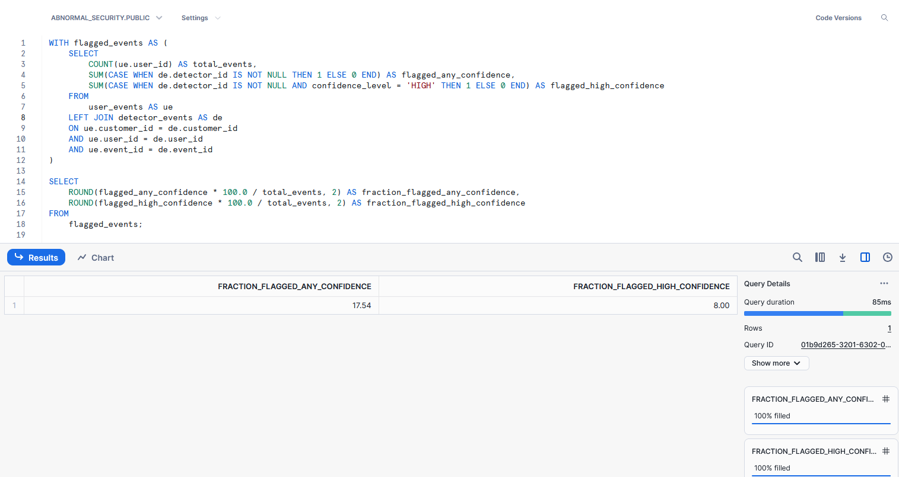
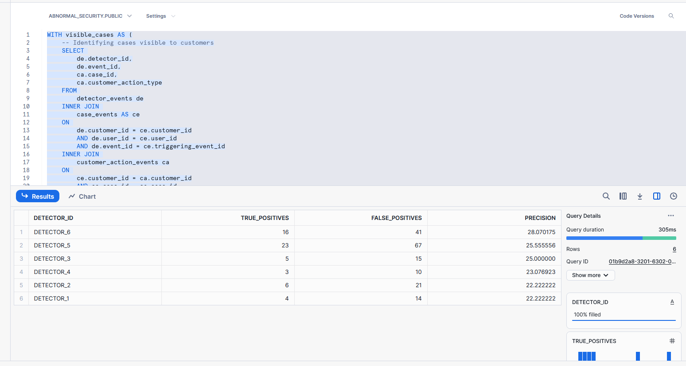

### Calculating metrics

1. What is the average monthly false negative rate (FNR) of the ATO product?
i. 𝐹𝑁𝑅 = 𝐹𝑁 / (𝑇𝑃 + 𝐹𝑁)

2. What is the average monthly false discovery rate (FDR) of the ATO product?
i. 𝐹𝐷𝑅 = 𝐹𝑃 / (𝑇𝑃 + 𝐹𝑃)

3. What fraction of user events are flagged by a detector at any confidence? At high confidence?

4. Calculate the precision of each detector based on cases which are made visible to customers. In other words, if a
case is not made visible to the customer, it does not count as either a TP or an FP. Which detector has the highest
precision? Which detector has the lowest precision?
i. 𝑃𝑟𝑒𝑐𝑖𝑠𝑖𝑜𝑛 = 𝑇𝑃 / (𝑇𝑃 + 𝐹𝑃)

5. Which detector flags the highest number of customer-confirmed true positive cases?
**Ans:** Detector 5 = 23 (shown in result of Q2 - d)