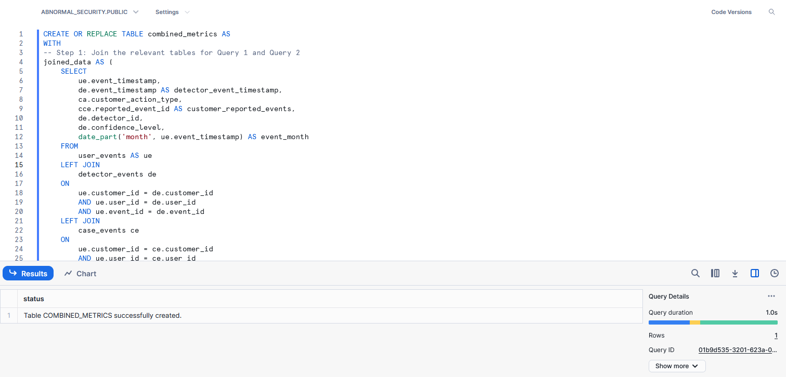
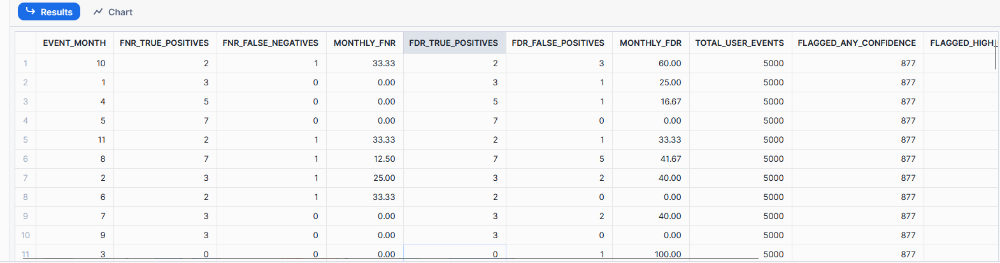
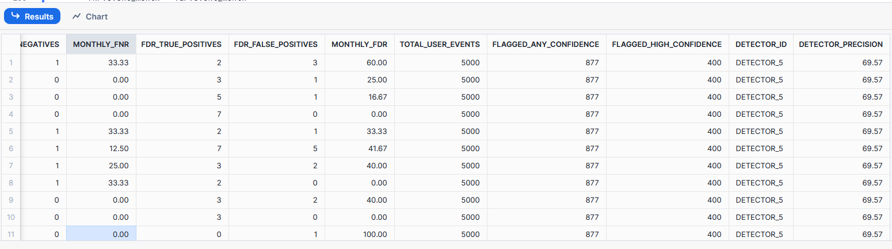

## Creating a table to combine all the metrics calculated

**Table creation:**

**Result output**:

Output present in csv file attached. 

#### Note: 
- The granularity of the metrics present in the table for the first 2 metrics FNR & FDR are at event month level
- The granularity of the metrics - `total_user_events`, `flagged_any_confidence` and `flagged_high_confidence` are at overall level (similar to the metric calculation done)
- The graunularity of the `detector_id` and `detector_precision` at detector_id level. 